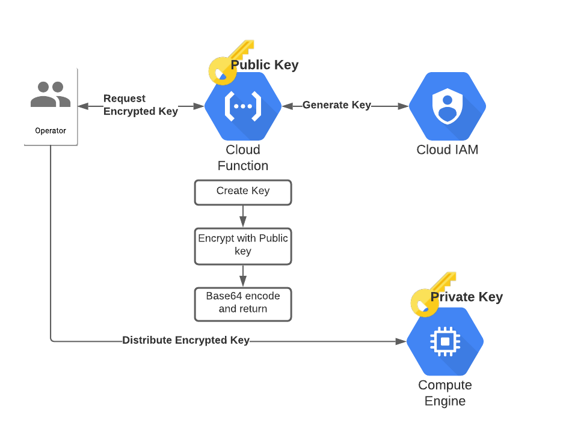

# GSA Encrypter

This solution allows operators to generate a service account key for another system (e.g. CICD pipeline) or user without
ever needing to see the key itself, adhering to the principle of least privilege. This is possible using assymmetric encryption
and the GPG software utility. This assumes the receiving service has a GPG private key which can be used to decrypt the service
account key, and the deployer of this function has access to the GPG public key.



## Deployment

### Prerequisites
To use Terraform to deploy this Cloud Function, you'll first need to specify your variables.

```
cp terraform.tfvars.sample terraform.tfvars
```

Change the project, org and cfn_members to suit your needs.

Next we need to export the public key the Cloud Function will use. Make sure you have the key you need in your local
gpg key chain. If it's in a public key server you can import it with:

```
gpg --recv-keys <key-id>
```

Once it's there locally, you can export the ASCII armored version of it with this and store it into a file:

```
gpg --export --armor <key-id> > pubkey.asc
```

Note that if you want to name the file something other than `pubkey.asc`, you'll need to override that variable in your
`terraform.tfvars`

### Apply

With your variables and public key setup, simply run:

```
terraform init
terraform apply
```

## Usage

When you run the terraform, a new script will appear at `scripts/get-key` from a template. This is a basic wrapper
script that writes an encrypted file after invoking the cloud function. Feel free to take this and expand on it for
your own use cases, or just run it as is.

```
./scripts/get-key <sa-email>
Success! Wrote encrypted key to <sa-email>.json.gpg
```

Now you can safely distribute this gpg-encrypted file to the server or container that has the private key associated
with it, all while you never had to see the service account key or the private key!

## Validation

Now let's try an end to end demo since we have everything deployed.

#### Create a new test GPG key

```
$ gpg --generate-key
pub   rsa2048 2020-08-17 [SC] [expires: 2022-08-17]
      91514EA9AA7111CD22EB786417316086C30144C8
uid                      Test User <thing@example.com>
sub   rsa2048 2020-08-17 [E] [expires: 2022-08-17]

$ gpg --export --armor 91514EA9AA7111CD22EB786417316086C30144C8 > pubkey.asc
```

#### Create a new service account

```
$ gcloud iam service-accounts create test-gsa --display-name "Test GSA"
```

#### Create an encrypted key for that service account

```
$ ./scripts/get-key test-gsa@<project-name>.iam.gserviceaccount.com
Success! Wrote encrypted key to test-gsa@<project-name>.iam.gserviceaccount.com.json.gpg
```

#### Verify the key decryption

```
gpg --decrypt test-gsa@<project-name>.iam.gserviceaccount.com.json.gpg > credentials.json
```

At this point `credentials.json` should have valid Google Cloud credentials.